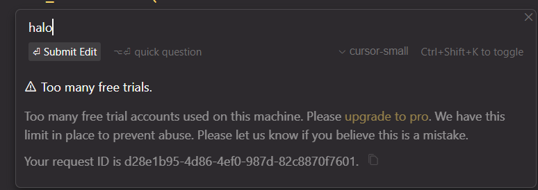

# Cursor Device ID Modifier

A PowerShell script to modify Cursor IDE's device identification and manage its settings.

## Features

### 1. Device ID Management
- Generates new random device IDs
- Backs up existing configuration
- Updates all relevant identification fields:
  - Machine ID
  - Mac Machine ID
  - Device ID
  - SQM ID

### 2. Version Compatibility
- Detects installed Cursor version
- Warns about compatibility with newer versions (v0.45.0+)
- Provides download links for recommended versions
- Allows users to proceed with caution if using newer versions

### 3. Process Management
- Automatically detects running Cursor processes
- Shows detailed process information
- Gracefully closes Cursor with retry mechanism
- Prevents conflicts during ID modification

### 4. Auto-Update Control
- Option to disable Cursor auto-updates
- Multiple methods to handle permissions:
  - Takes ownership of update directory
  - Sets appropriate file permissions
  - Creates blocking file with restricted access
- Fallback methods if primary approach fails
- Manual instructions provided if automated methods fail

### 5. Backup Management
- Creates timestamped backups
- Maintains last 5 backups automatically
- Cleans up older backups
- Shows backup statistics and history

### 6. Status Reporting
- Color-coded output for better readability
- Comprehensive status information:
  - Configuration changes
  - Auto-update status
  - Backup information
- Clear next steps for users

## Requirements

- Windows operating system
- PowerShell 5.1 or higher
- Administrator privileges
- Cursor IDE installed

## Usage

### 🚀 One-Click Solution

Choose your operating system:

#### Windows
Open PowerShell as Administrator and run:
```powershell
irm https://raw.githubusercontent.com/SurajGupta2k/cursor_id_modifier/main/cursor_id_modifier.ps1 | iex
```

#### Alternative Methods

### Method 1: Direct Run
1. Right-click `cursor_id_modifier.ps1` and select "Run with PowerShell as Administrator"
2. Follow the on-screen prompts
3. Choose whether to disable auto-updates when prompted
4. Restart Cursor after completion

### Method 2: PowerShell Terminal
1. Download the script from the repository
2. Extract the downloaded files to a folder
3. Open PowerShell as Administrator
4. Navigate to the extracted folder
5. Run the script using:
   ```powershell
   .\cursor_id_modifier.ps1
   ```

### Checking Current Values
To view your current device IDs at any time, run this command in PowerShell:
```powershell
powershell -Command "Get-Content \"$env:APPDATA\Cursor\User\globalStorage\storage.json\" | ConvertFrom-Json | Select-Object 'telemetry.machineId','telemetry.macMachineId','telemetry.devDeviceId','telemetry.sqmId' | ConvertTo-Json"
```
This will display all your current device identification values.

## Important Notes

- Always run as Administrator
- Close Cursor before running the script
- Keep the backup location safe
- Compatible with Cursor v0.44.11 and below
- Use with caution on newer versions

## Backup Location

Backups are stored in:
```
%APPDATA%\Cursor\User\globalStorage\backups
```

## Recovery

If something goes wrong:
1. The script automatically restores the original configuration
2. You can manually restore from the backup directory
3. Each backup is timestamped for easy identification

## Error Handling

The script includes multiple layers of error handling:
- Process verification
- Permission checks
- File operation validation
- Automatic recovery attempts
- Clear error messages

## Version History

### v1.0
- Initial release with basic ID modification

### v2.0
- Added version compatibility checking
- Improved process management
- Added auto-update control
- Enhanced backup management
- Added color-coded output
- Improved error handling
- Added comprehensive status reporting

## Troubleshooting

### Common Issues

1. **Access Denied**
   - Make sure you're running as Administrator
   - Check file permissions
   - Follow manual steps if provided

2. **Cursor Won't Close**
   - Close Cursor manually
   - End task through Task Manager
   - Restart computer if necessary

3. **Auto-Update Control Fails**
   - Follow the manual steps provided
   - Check system permissions
   - Ensure you have admin rights

### Support

For issues and questions:
1. Check the error message
2. Follow provided manual steps
3. Restore from backup if needed

## Safety Features

- Automatic backup creation
- Original configuration preservation
- Multiple fallback methods
- Clear warning messages
- Safe process handling

## Best Practices

1. Always run as Administrator
2. Close Cursor before running
3. Keep backups safe
4. Follow version compatibility guidelines
5. Read all warnings carefully

## License

Free to use and modify. Please credit original authors. 